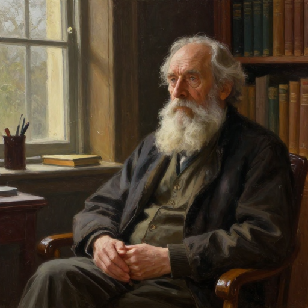
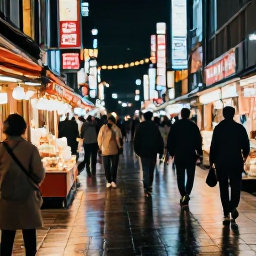
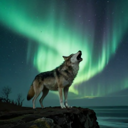

# Z-Image Turbo: Few‑Step Text‑to‑Image Generation

## Overview

**Z-Image Turbo** is a fast **text-to-image diffusion inference project** built on top of the Z-Image architecture. It focuses on generating high-quality images using **only a few denoising steps** to reduce inference latency, making it suitable for interactive applications and large-scale deployment.

This repository focuses on inference usage only — how to run Z‑Image Turbo for text‑to‑image generation, and how its internal pipeline works.

---

## Features

- ⚡ **Fast inference** with very few denoising steps  
- 🧠 **Diffusion Transformer (DiT)** backbone  
- 📝 Strong text understanding via **Qwen3-4B text encoder**  
- 🖼️ High-quality image decoding using **Flux VAE**
- 🔁 Deterministic and stable sampling, ideal for production use
- 🧩 Modular design, easy to integrate with existing diffusion pipelines

---

## Model Pipeline

Below is the end‑to‑end pipeline for text‑to‑image inference using Z‑Image Turbo:
```text
Text Prompt
   ↓
Text Encoder (Qwen3-4B)
   ↓
Text Embeddings
   ↓
Gaussian Noise Latents (z_T)
   ↓
Few-Step Diffusion Transformer (Z-Image Turbo)
   ↓
Denoised Latents (z_0)
   ↓
VAE Decoder (Flux VAE)
   ↓
Final RGB Image

```

### Denoising Process

- The model starts from **Gaussian noise** in latent space  
- At each step, the diffusion model predicts a **noise residual**  
- The scheduler updates the latent state using this prediction  
- Thanks to few-step distillation, **each step performs a large, deterministic denoising jump**

---

## Example Results

This section showcases **example outputs generated by Z-Image Turbo** using a variety of **custom text prompts**. These examples highlight the model’s ability to preserve **semantic alignment**, **visual quality**, and **stylistic consistency** even under **few-step inference**.

| Image | Prompt |
|------|---------|
|  | An elderly man with a long white beard, sitting in a cozy library, oil painting style |
|  | A busy night market in Tokyo with neon signs reflecting on wet pavement |
|  | A wolf howling on a cliff with the Aurora Borealis behind it |
|  | A wizard casting a glowing spell in a dark ancient library |
|  | A pirate ship in a thunderstorm with dramatic waves and lightning |

> 💡 For the full list of prompts, please refer to [`examples/prompts.txt`](examples/prompts.txt).
